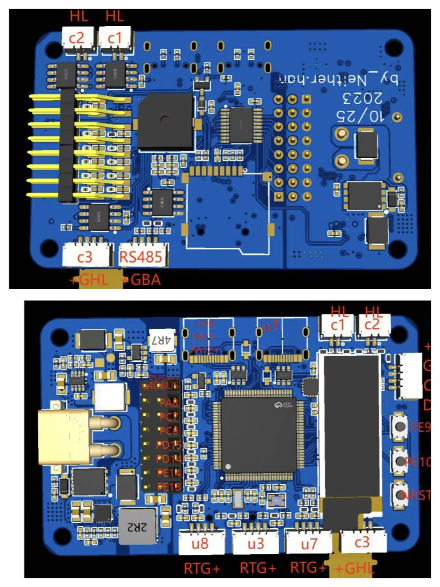

# DMH7
#  达妙的can接口全是左高右低

## 接口映射

| 设备   | 接口   |
| ------ | ------ |
| 底盘   | CAN2   |
| 云台   | CAN1   |
| C板    | CAN3   |
| DBUS   | UART4  |

## 实物图

## 模式
| 模式	| 左拨杆| 	右拨杆| 	备注
| ------ | ------ |------ | ------ |
| 不动模式| 	下| 	下| 	
| 正常模式| 	下	| 中| 	
| 常规小陀螺| 	中| 	中| 	
| 小陀螺调速| 	中| 	上| 	右侧遥感上下打到底，并回正，步长为0.01调速。此时底盘和云台无遥感输入控制| 	
| 调速后小陀螺| 	下| 	上| 	以上方调速后的速度开启小陀螺，同时底盘和云台由遥感控制
